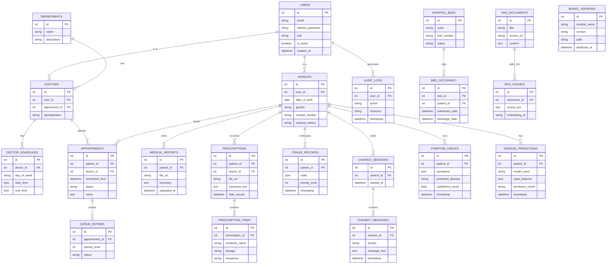

# Database Schema

```mermaid
erDiagram
    USERS ||--o{ PATIENTS : "is a"
    USERS ||--o{ DOCTORS : "is a"
    USERS ||--o{ AUDIT_LOGS : "generates"
    USERS {
        int id PK
        string email
        string hashed_password
        string role
        boolean is_active
        datetime created_at
    }
    
    DEPARTMENTS ||--o{ DOCTORS : has
    DEPARTMENTS {
        int id PK
        string name
        string description
    }
    
    DOCTORS ||--o{ DOCTOR_SCHEDULES : has
    DOCTORS ||--o{ APPOINTMENTS : attends
    DOCTORS {
        int id PK
        int user_id FK
        int department_id FK
        string specialization
    }
    
    DOCTOR_SCHEDULES {
        int id PK
        int doctor_id FK
        string day_of_week
        time start_time
        time end_time
    }
    
    PATIENTS ||--o{ APPOINTMENTS : books
    PATIENTS ||--o{ MEDICAL_REPORTS : owns
    PATIENTS ||--o{ PRESCRIPTIONS : receives
    PATIENTS ||--o{ TRIAGE_RECORDS : undergoes
    PATIENTS ||--o{ CHATBOT_SESSIONS : starts
    PATIENTS ||--o{ SYMPTOM_CHECKS : runs
    PATIENTS ||--o{ DISEASE_PREDICTIONS : has
    PATIENTS {
        int id PK
        int user_id FK
        date date_of_birth
        string gender
        string contact_number
        string medical_history
    }
    
    APPOINTMENTS ||--o{ QUEUE_ENTRIES : creates
    APPOINTMENTS {
        int id PK
        int patient_id FK
        int doctor_id FK
        datetime scheduled_time
        string status
        text notes
    }
    
    HOSPITAL_BEDS ||--o{ BED_OCCUPANCY : logs
    HOSPITAL_BEDS {
        int id PK
        string ward
        string bed_number
        string status
    }
    
    BED_OCCUPANCY {
        int id PK
        int bed_id FK
        int patient_id FK
        datetime admission_date
        datetime discharge_date
    }
    
    QUEUE_ENTRIES {
        int id PK
        int appointment_id FK
        int priority_level
        string status
    }
    
    SYMPTOM_CHECKS {
        int id PK
        int patient_id FK
        json symptoms
        string predicted_disease
        float confidence_score
        datetime timestamp
    }
    
    DISEASE_PREDICTIONS {
        int id PK
        int patient_id FK
        string model_used
        json input_features
        string prediction_result
        datetime timestamp
    }
    
    MEDICAL_REPORTS {
        int id PK
        int patient_id FK
        string file_url
        text summary
        datetime uploaded_at
    }
    
    PRESCRIPTIONS ||--o{ PRESCRIPTION_ITEMS : contains
    PRESCRIPTIONS {
        int id PK
        int patient_id FK
        int doctor_id FK
        string file_url
        text extracted_text
        datetime date_issued
    }
    
    PRESCRIPTION_ITEMS {
        int id PK
        int prescription_id FK
        string medicine_name
        string dosage
        string frequency
    }
    
    TRIAGE_RECORDS {
        int id PK
        int patient_id FK
        json vitals
        int priority_level
        datetime timestamp
    }
    
    CHATBOT_SESSIONS ||--o{ CHATBOT_MESSAGES : contains
    CHATBOT_SESSIONS {
        int id PK
        int patient_id FK
        datetime started_at
    }
    
    CHATBOT_MESSAGES {
        int id PK
        int session_id FK
        string sender
        text message_text
        datetime timestamp
    }
    
    RAG_DOCUMENTS ||--o{ RAG_CHUNKS : splits_into
    RAG_DOCUMENTS {
        int id PK
        string title
        string source_url
        text content
    }
    
    RAG_CHUNKS {
        int id PK
        int document_id FK
        text chunk_text
        string embedding_id
    }
    
    MODEL_VERSIONS {
        int id PK
        string module_name
        string version
        string path
        datetime deployed_at
    }
    
    AUDIT_LOGS {
        int id PK
        int user_id FK
        string action
        string resource
        datetime timestamp
    }
```
